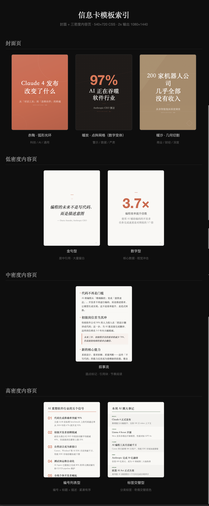

# write-anything

多平台内容生成 AI Skill —— 支持**今日头条**、**小红书**和 **Twitter / X**，覆盖从选题到成稿输出的完整流程。

兼容 [Claude Code](https://docs.anthropic.com/en/docs/claude-code) 的 skill 格式。安装后说「写一篇头条文章」、「写一篇小红书笔记」或「发一条 X」即可触发完整流程。

## 它能做什么

```
"写一篇头条文章"
  → 框架选择 → 素材采集 + 内容增强
  → 写作（真实信息锚定 + 风格注入 + 编辑锚点）
  → SEO优化 + 质量验证 → AI配图 → 输出 Markdown

"写一篇小红书笔记"
  → 框架选择（按平台限制）→ 素材采集 + 内容增强
  → 写作（emoji 分段 + 口语化 + 话题标签）
  → SEO优化 + 质量验证 → 竖版配图 → 输出笔记文案 + 图片序列

"发一条 X"
  → 框架选择 → 素材采集 + 内容增强
  → 写作（3-6 句短推 + 单核心观点）
  → 传播优化 → 输出推文 + 可选配图
```

首次使用时会引导你选择平台和风格，之后每次只需一句话。生成的文章带有 2-3 个编辑锚点——花 3-5 分钟加入你自己的话，文章就会从"AI 初稿"变成"你的作品"。

## 平台差异

| 维度 | 今日头条 | 小红书 | Twitter / X |
|------|---------|--------|------------|
| 标题 | ≤30 字 | ≤20 字，建议有视觉记忆点 | 无 H1，直接输出短推 |
| 正文 | 800-3000 字，H2 分段 | 200-1000 字，emoji 或短段分隔 | 50-280 字，3-6 句短句 |
| 配图 | 封面 16:9 + 内文图 | 竖版 3:4，1-9 张图片序列 | 最多 1 张，按需生成 |
| SEO / 可发现性 | 标题+摘要+前 3 段 | 标题+前 2 行+话题标签 | 前 2 行+0-2 个 hashtags |
| 输出 | Markdown | Markdown（口语化分段+话题标签风格） | Markdown（单条推文） |

平台切换通过 `config.yaml` 的 `default_platform` 字段完成，具体参数定义见 `references/platform-profiles.yaml`。本次请求中明确提到的平台优先于默认设置。

## 信息卡：一句话把任何内容变成可分享的图片

把文章、URL、或一段文字扔给它，自动提炼核心观点 → 生成杂志质感 HTML 卡片 → 截图输出 PNG。适合直接发小红书轮播或 Twitter 长图。

```
"做张信息卡"
  → 输入文本 / URL / 刚写完的文章
  → 提炼核心论点 + 关键数据 + 因果链
  → 选配色（赤陶/暖炭/暖沙/橄榄/紫藤/深青）
  → 生成封面 + 内容页 HTML（540×720，输出 1080×1440）
  → 自动截图 → 输出 PNG 序列
```

**支持的输入**：X/Twitter 链接、微信公众号文章、arXiv 论文、任意网页 URL、纯文本、刚写完的文章（自动读取 `output/` 最新文件）。

**设计规范**：瑞士国际主义排版 + 固定 3:4 比例 + 6 套主题配色 + 内容超长自动分页。详见 [`references/info-card-design-spec.md`](references/info-card-design-spec.md)。

<p align="center">
  
</p>

> 包含封面页（3 种配色）、低/中/高密度内容页共 8 种模板。完整 HTML 源码见 [`examples/`](examples/) 目录，可用浏览器打开 [`examples/index.html`](examples/index.html) 预览全部样式。

## 核心能力

| 能力 | 说明 | 实现 |
|------|------|------|
| SEO 分析 | WebSearch + LLM 驱动的多维关键词分析（需求热度 / 搜索意图 / 长尾扩展 / 平台适配） | `references/seo-keyword-analysis.md` |
| 素材采集 | WebSearch 真实数据/引述/案例 | SKILL.md Step 2.2 |
| 框架生成 | 7 套写作骨架（痛点/故事/清单/对比/热点解读/纯观点/复盘） | `references/frameworks.md` |
| 内容增强 | 按框架类型自动匹配：角度发现/密度强化/细节锚定/真实体感 | `references/content-enhance.md` |
| 文章写作 | 真实信息锚定 + 风格注入 + 编辑锚点 | `references/writing-guide.md` |
| 发布优化 | 平台差异化：标题/摘要/关键词位置/标签/可发现性 | `references/seo-rules-*.md` |
| 视觉 AI | 封面 + 内文配图（按平台自动切换尺寸） | `scripts/image_gen.py` |
| 信息卡 | 文本/URL/文章 → 杂志质感 HTML 信息卡 → PNG 截图 | `references/info-card-design-spec.md` |
| 个人风格 | 按平台存储写作偏好和范例，AI 可主动更新 | `my-style/` |

## 发布（配合外部 Skill）

write-anything 只负责**内容生成**，发布通过外部 Skill 完成：

### 今日头条发布

```bash
npx @anthropic-ai/superinterface skills add https://github.com/guanyang/super-publisher --skill toutiao-publisher
```

安装后说「发布到头条」即可触发。基于 Playwright 自动化，首次需扫码登录。

### 小红书发布

```bash
git clone https://github.com/white0dew/XiaohongshuSkills.git
```

配合本地 `xhs-publish` skill 使用。支持图文发布、视频发布、笔记搜索、内容数据查看。说「发布到小红书」即可触发。

### 可选：Baoyu 增强 Skills

以下 skill 可增强 write-anything 的视觉能力（需单独安装）：

| Skill | 能力 | 触发 |
|-------|------|------|
| `baoyu-cover-image` | 为文章生成手绘风封面图（多风格可选） | 「生成封面」 |
| `baoyu-xhs-images` | 生成小红书信息图系列（1-10 张卡通风格） | 「小红书图片」 |
| `baoyu-article-illustrator` | 智能分析文章内容，在需要配图的位置自动生成插图 | 「加插图」 |

## 内容质量

write-anything 的目标不是"骗过 AI 检测"，而是**写出值得读的文章**。核心机制：

1. **内容增强**：根据框架类型自动执行不同策略——热点文找反直觉角度、干货文强化信息密度、故事文锚定真实细节、对比文注入真实用户体感
2. **素材采集**：自动 WebSearch 真实数据/引述/案例，锚定在文章中（不编造）
3. **个人风格库**：在 `my-style/` 按平台维护你的写作偏好和范例片段，AI 写作时自动参考
4. **编辑锚点**：在 2-3 个关键位置标记"在这里加一句你自己的话"
5. **学习飞轮**：每次你编辑后说"学习我的修改"，下次初稿更接近你的风格
6. **文章自检**：说"检查一下"，查看生成档案（用了什么框架/人格/策略）+ 质量检查（具体到哪句话该怎么改）

## 安装

### Amp / Claude Code

```bash
npx skills add https://github.com/limboinf/write-anything
```

安装后自动配置依赖。有更新时说"更新"即可升级。

### OpenClaw

把仓库地址告诉 AI：

> 帮我安装这个 skill：https://github.com/limboinf/write-anything

AI 会自动完成安装和配置。

### 手动安装

```bash
git clone --depth 1 https://github.com/limboinf/write-anything.git ~/.claude/skills/write-anything
cd ~/.claude/skills/write-anything && pip install -r requirements.txt
```

### 配置（可选）

```bash
cp config.example.yaml config.yaml
```

填入图片 API key（生图需要）。不配也能用——自动降级为输出图片提示词。

## 快速开始

```
你：写一篇头条文章
你：写一篇关于 AI Agent 的头条文章
你：写一篇小红书笔记
你：交互模式，写一篇关于效率工具的文章
你：帮我润色一下刚才那篇
你：更新我的风格                  → 更新 my-style 风格文件
你：看看文章数据怎么样            → 效果复盘
你：检查一下                      → 生成报告 + 质量自检
你：发布到头条                    → 调用 toutiao-publisher skill
你：发布到小红书                  → 调用 xhs-publish skill
你：发一条 X / 写一条推特         → 生成单条短推
你：做张信息卡                    → 文章/文本/URL → 杂志质感卡片
你：今天计划 小红书:3 头条:2       → 设置每日发文目标
你：今日进度                      → 查看文章矩阵状态
```

## 目录结构

```
write-anything/
├── SKILL.md                  # 主管道（Step 1-7）
├── config.example.yaml       # API 配置模板
├── requirements.txt
│
├── scripts/                  # 工作流工具
│   ├── daily.py                # 每日内容矩阵管理
│   ├── image_gen.py            # AI 图片生成（Ark / Gemini，可指定 provider）
│   ├── screenshot.py           # HTML → PNG 截图（信息卡用）
│   └── card_slice.py           # 信息卡拼接 / 分割
│
├── references/               # Agent 按需加载
│   ├── writing-guide.md        # 写作规范 + 质量检查规则
│   ├── writing-evaluation-phrases.md   # 写作评估：高频套话 / 空话清单
│   ├── writing-evaluation-structures.md # 写作评估：结构模板风险清单
│   ├── writing-evaluation-examples.md   # 写作评估：中文改写示例
│   ├── frameworks.md           # 7 种写作框架
│   ├── content-enhance.md      # 内容增强策略
│   ├── platform-profiles.yaml  # 平台参数表（头条/小红书/Twitter）
│   ├── platform-writing-rules.md # 平台写作差异规则
│   ├── seo-keyword-analysis.md # WebSearch + LLM 关键词分析指南
│   ├── seo-rules-toutiao.md    # 头条 SEO 规则
│   ├── seo-rules-xiaohongshu.md # 小红书 SEO 规则
│   ├── seo-rules-twitter.md    # Twitter SEO / 传播规则
│   ├── info-card-design-spec.md # 信息卡设计规范
│   ├── visual-prompts.md       # 视觉 AI 提示词规范
│   ├── onboard.md              # 首次设置流程
│   └── performance-review.md   # 效果复盘流程
│
├── output/                   # 生成的文章 + 信息卡
└── my-style/                 # 个人写作风格（按平台分文件）
```

运行时自动生成（不入 git）：`config.yaml`、`my-style/*.md`

## 工作流程

```
Step 1  环境检查 + 加载风格 + 加载平台参数（不存在则 Onboard）
  ↓
Step 2  框架选择（按平台限制）→ 素材采集 + 内容增强
  ↓
Step 3  个人风格注入 → 写作（平台规则 + 编辑锚点）
  ↓
Step 4  SEO 优化（平台差异化）→ 质量验证（Agent 按 writing-evaluation 规则评审）
  ↓
Step 5  视觉 AI（按平台切换封面/配图尺寸）
  ↓
Step 6  预检 + 输出 Markdown
  ↓
Step 7  Daily Tracker 联动 → 回复用户（含编辑建议 + 飞轮提示）
```

默认全自动。说"交互模式"可在选题/框架/配图处暂停确认。

## 参考项目

- https://github.com/oaker-io/wewrite
- https://github.com/joeseesun/info-card-designer

## License

MIT
